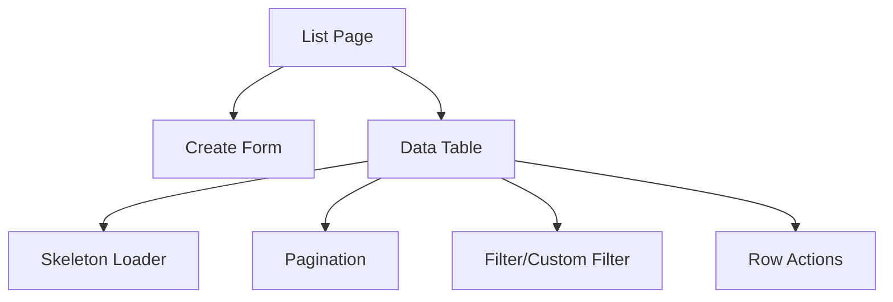

# Prisma Schema Design

[...existing schema and ERD content remain unchanged...]

---

# UI Layout & Page Plan

## General Rules

- Use [shadcn/ui](https://ui.shadcn.com/) components for all UI. Install if needed
- Show a `<Skeleton />` when data is loading:
  ```tsx
  import { Skeleton } from "@/components/ui/skeleton";
  isLoading ? <Skeleton className="h-4 w-32 mt-1" /> : ...
  ```
- Use a Data Table for all list views.
- Data Table must support:
  - Pagination
  - Filter & custom filter
  - Row-level custom actions (edit, delete, detail, etc.)
- When creating, render the create form above the data table (unless a dedicated create page is required).

---

## Page Layout Plan

### 1. List Page (Index)
- Header with title and optional global actions (e.g., "Create New").
- Create form (collapsible or always visible) above the data table.
- Data Table with:
  - Columns for all key fields
  - Pagination controls
  - Filter/search bar
  - Custom filter dropdowns (per column or global)
  - Row actions (edit, delete, view)
- Show `<Skeleton />` for table and form while loading.

### 2. Create Page (if needed)
- Standalone page for creating new data (only if not inline).
- Form with validation and submit.
- Show `<Skeleton />` while loading.

### 3. Edit/Detail Page
- Form pre-filled with data for editing.
- Show `<Skeleton />` while loading.
- Optionally, show related data tables (e.g., for relations).

---

## Example Mermaid Diagram: Page & Component Structure



---

## Component Usage

- **Skeleton**: Use for all async data fetches.
- **Data Table**: Use shadcn/ui table, extend for pagination/filter/actions.
- **Forms**: Use shadcn/ui form components, validation with Zod or similar.

---

## Next Steps

- Implement each entity page following this layout.
- Use the documented schema for all data operations.
- Review this plan and suggest changes if needed.